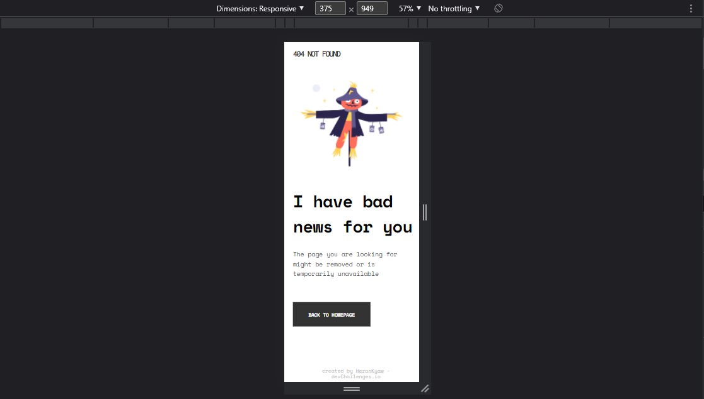
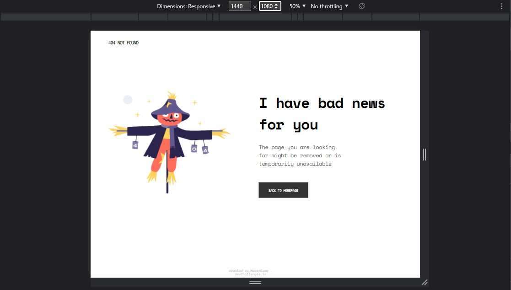

<!-- Please update value in the {}  -->

<h1 align="center">404 page</h1>

   Solution for a challenge from  <a href="http://devchallenges.io" target="_blank">Devchallenges.io</a>.

  <h3>
    <a href="https://heronkyaw.github.io/404-page/">
      Demo
    </a>
     | 
    <a href="https://devchallenges.io/solutions/BWKdhAn1cs1ydM5SPozh">
      Solution
    </a>
     | 
    <a href="https://devchallenges.io/challenges/wBunSb7FPrIepJZAg0sY">
      Challenge
    </a>
  </h3>

<!-- TABLE OF CONTENTS -->

## Table of Contents

- [Overview](#overview)
  - [Built With](#built-with)
- [Features](#features)
- [Contact](#contact)
- [Acknowledgements](#acknowledgements)

<!-- OVERVIEW -->

## Overview

Screenshot for 375 x 949

Screenshot for 1440 x 1080

Q: Where can I see your demo?
- I provided the Github link above. You can just click the demo.

Q: What was your experience?
- I was confused to choose between pure CSS and boostrap 5 to complete this challenge. Then, I found out the pure CSS is more suited for this project than the Bootstrap 5.

Q: What have you learned/improved?
- I have learned how to work with the design. That was pretty cool because it makes me feel like I am working at a company. Also, I've improved my Flexbox skill of CSS.

### Built With

<!-- This section should list any major frameworks that you built your project using. Here are a few examples.-->

- HTML
- Pure CSS

## Features

<!-- List the features of your application or follow the template. Don't share the figma file here :) -->

This application/site was created as a submission to a [DevChallenges](https://devchallenges.io/challenges) challenge. The [challenge](https://devchallenges.io/challenges/wBunSb7FPrIepJZAg0sY) was to build an application to complete the given user stories.

## Contact

- GitHub [@HeronKyaw](https://github.com/HeronKyaw)
- Linkedin [Wunna Kyaw](https://www.linkedin.com/in/wunnakyaw11/)